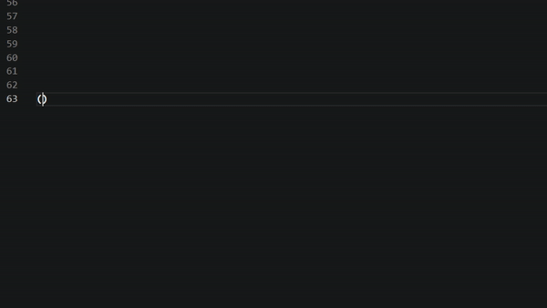

**Atlas** provides the the following forms of support for Halo Script iterations (Atlas currently supports Halo 1, Halo 2, and Halo 3).
- Autocomplete features using intellisense
- Full function descriptions, return types, and parameters for Halo Script functions. 
- Value type listings through intellisense. Type # for a list of value types (e.g. a list of teams)
- A theme specifically designed for the language
- Syntax highlighting

Future support for other Halo titles is planned as official mod tools are released for those games.

**======Guide=======**

**Enabling the theme**

The theme can be enabled through the VSCode toolbar by selecting File>Preferences>Color Theme, and then selecting "Atlas". Alternatively, you can bring up the theme select menu using Ctrl+K followed by Ctrl+T

**Using intellisense with Atlas**

Ctrl+Spacebar is the default shortcut to use intellisense. Once enabled you will be able to see a list autocomplete options each time you begin typing. Press Ctrl+Spacebar again to turn this function off.

You can use your arrow keys to navigate the autocomplete options, if not already showing, you can press Ctrl+Spacebar again to see details of the function. After confirming the selection with tab or enter, you will see the function name along with its parameters. You can use tab to jump between parameters and type to overwrite them.

Below is a breakdown of the snippet details.

**Inserting snippets with the command palette**

Any autocomplete function can also be input via snippets using the command palette. By default the command palette can be accessed by the shortcut Ctrl+Shift+P or through the menu by selecting View>Command Palette. The Insert Snippet command is an alternative way to insert functions and quick templates for Halo Script, and allows you to also search function descriptions.

Provided alongside function details are value type lists and templates. Value type lists always begin with #, they provide a list of enumerated values, value types, or engine globals by group. For example #teams brings up a list of available ai teams.

The following templates are available, these can either be selected through snippets or using intellisense:

startup - creates an empty startup script
dormant - creates an empty dormant script
continuous - creates an empty continuous script
static - creates an empty static script
static-w/parameter - creates an empty static script with a single parameter
command_script - creates an empty command_script
stub - creates an empty stub script
stub-w/parameter - creates an empty stub script with a single parameter

global - creates a template for inserting a global variable

loop - generates a template for a loop

**Syntax highlighting** 

Syntax highlighting is provided for the following types:

- Comments
- Numbers
- Strings
- Operators
- Booleans
- Class (i.e. Script / Global types)
- Script type (e.g. startup, static...)
- Enumerated values, such as 'heroic' which represents a number
- Value types (e.g. void, real, ai...)
- Engine globals, which are global variables that can be used without the user needing to declare them (e.g. game_speed, ai_current_actor)
- HaloScript functions (e.g. ai_place, object_create...)
- Script names, the extension will apply highlighting to words which refer to a user defined script name.
- Any item using the foreground colour is assumed to be a global variable, tag, or a reference to an entity defined in a scenario tag (e.g. an object name or ai objective). 

There is small level of error checking in use by the highlighter, for example the "+" in (1 + 4) would not be highlighted, as this is an incorrect placement for a function.

The image below is an example made using the packaged theme.

### 1.0.0

Initial release

#Known issues

- Script name highlighting will be incorrectly applied where the name is expected two parameters after the function name, and the first parameter is attained using an expression group.
