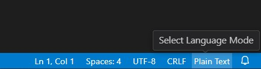
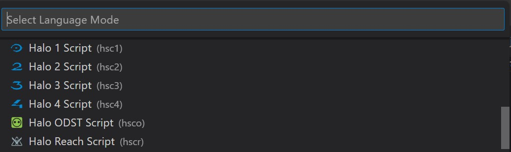
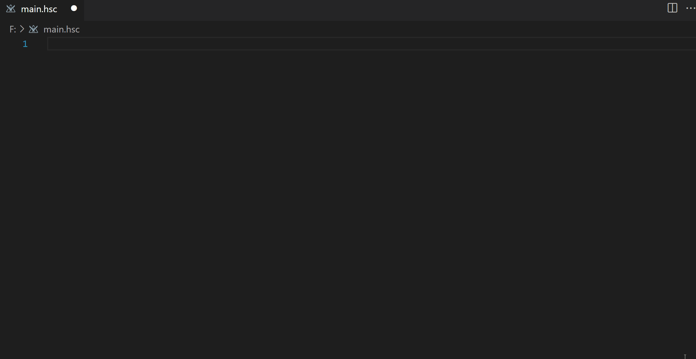
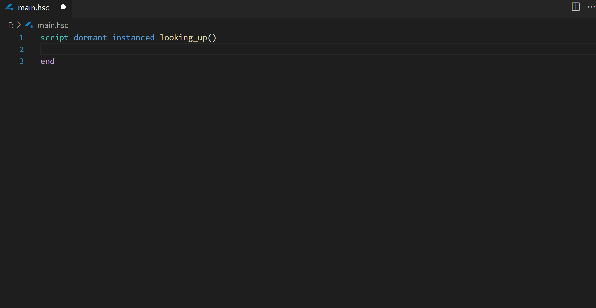
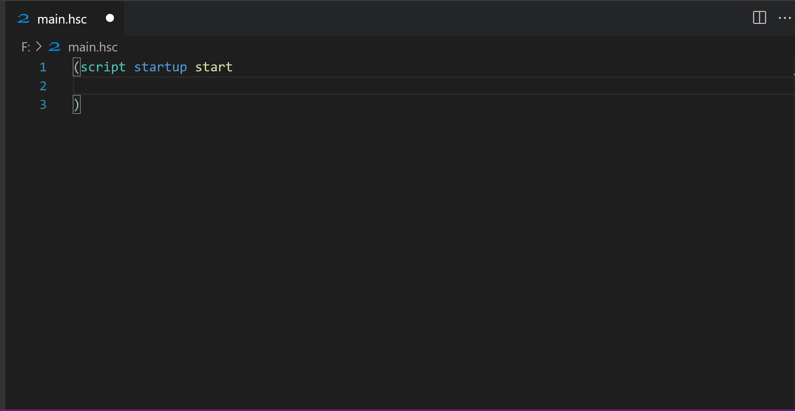
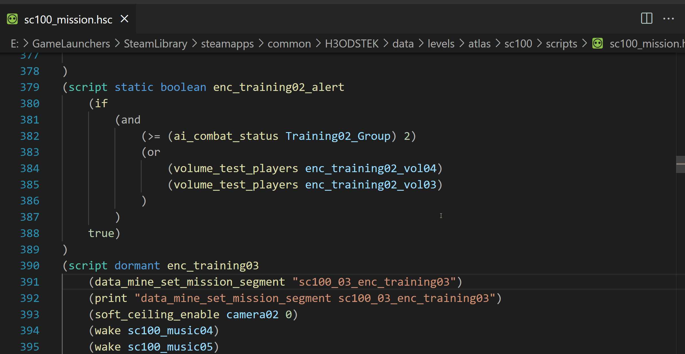

**HaloScript** is a comprehensive language support extension for all iterations of the Halo Script language used in the Halo: The Masterchief Collection Mod Tools. HaloScript provides:
- Autocompletion
- Documentation on all HaloScript functions
- Hover descriptions for HaloScript elements
- Function argument hints
- Syntax highlighting
- Snippets
- Error Checking
- On-demand scenario script compilation

## Supported Games

| Game | Language |
| ----------- | ----------- |
| Halo 1 MCC | hsc1 |
| Halo 2 MCC | hsc2 | 
| Halo 3 MCC | hsc3 | 
| Halo ODST MCC | hsco | 
| Halo Reach MCC | hscr | 
| Halo 4 MCC | hsc4 | 
| Halo 2 Anniversary MP MCC | hsc4 |

## Getting Started

### Setting the language

This extension contributes each game's Halo Script iteration as a separate language. For a saved `.hsc` file inside a detected Editing Kit's canonical `data` or `tags` folder, HaloScript automatically switches to the matching game language. Detection uses the configured Editing Kit paths, standard kit folder names, and Steam installations.

Files outside an Editing Kit keep their current language selection. You can select a language manually from the ***Status Bar***, or disable `atlas.compiler.autoDetectScriptLanguage` if you always prefer manual language selection. Compiler commands still detect the containing Editing Kit so Halo 4 and Halo 2 Anniversary MP use the correct `tool.exe`.





The HaloScript syntax comes in two flavours: the classic Lisp-style syntax used in Halo 1 through Reach, and the newer C-like syntax used by Halo 4 and Halo 2 Anniversary MP.

 You can set the default .hsc file language by editing your user settings.json file. For example to set Halo 4 Script as the default you would add:

```
    "files.associations": {
        "*.hsc": "hsc4"
    },
```

HaloScript is compatiable with any VSCode theme. ***Dark (Visual Studio - C/C++)*** is the theme used in the examples below.

### Using Snippets

Snippets are templates you can add to help you quickly add code to your scripts. HaloScript includes a large number of snippets for quickly creating template scripts, variables and loops. Snippets are also the method for quickly accessing the various enum values present in HaloScript.

> If snippets are not showing when you start typing, you can press `CTRL+SPACE` to trigger Intellisense. Snippets can be distinguished from other autocomplete suggestions by the square icon. Once the snippet is highlighted, you can press `TAB` to insert it. Certain snippets included multiple parts, you can use `TAB` to jump between these.

The full snippets list can be accessed through the ***Command Palette*** (shortcut `CTRL+SHIFT+P`), and selecting ***Insert Snippet***.



### Autocompletion

HaloScript offers automcompletion for functions, built-in globals, value types, script types, and keywords. Autocomplete suggestions will show as you type. Use `TAB` to accept the autocomplete suggestion. 

Autocomplete suggestions will also display relevant information, such as descriptions and accepted arguments for a function. When accepting an autocomplete suggestion for a function, parentheses will be automatically inserted if they are not already present.



### Argument Hints

Argument hints are displayed when writing out a HaloScript function. These hints will highlight the structure of the arguments required for a function, the function description, the current argument to input, and a description of the type of argument to supply.

Arguments that end with `?` are optional.



### Hover Descriptions

Simply hover over any HaloScript function, built-in global, value type, or keyword to prompt a description of that item.



### Extension Recommendations

[TabOut](https://marketplace.visualstudio.com/items?itemName=albert.TabOut) lets you use the tab key to jump out parentheses using `TAB`. This will make it a much smoother experience to work with HaloScript given its heavy use of parentheses.

### Error Checking

HaloScript includes a basic level of debugging. The extension will report unmatched opening and closing parentheses, with plans to expand error checking further in the future.

### Compiling Scenario Scripts

While editing a saved `.hsc` file, select the **Compile HaloScript** tools button in the editor title or status bar. You can also run **HaloScript: Compile Scenario Scripts** from the Command Palette or the editor context menu.

If an automatic or remembered target is not the scenario you want, run **HaloScript: Compile Scenario Scripts (Choose Scenario)** to replace that association.

The compiler:

- detects the containing Editing Kit before choosing the game language and Tool command;
- saves dirty `.hsc` files from the same `scripts` folder by default;
- auto-detects Steam library locations, with manual paths available in the `HaloScript` settings;
- mirrors a classic `data\...\scripts` location to the corresponding `tags\...` directory;
- selects an unambiguous `.scenario` automatically and asks when more than one target is possible; and
- streams the exact command and all Tool output to the **HaloScript Compiler** output channel.

Stock standalone compilation is available for Halo 2 (`rebuild-scenario-scripts`), Halo 4 (`compile-scripts`), and Halo 2 Anniversary MP (`compile-scripts`). Compile controls are disabled for Halo 1, Halo 3, ODST, and Reach because their stock tools do not expose an equivalent standalone script compiler.

Example manual configuration:

```json
"atlas.compiler.autoDetectScriptLanguage": true,
"atlas.compiler.editingKitPaths": {
    "hsc2": "D:\\SteamLibrary\\steamapps\\common\\H2EK",
    "hsc4": "D:\\SteamLibrary\\steamapps\\common\\H4EK",
    "h2amp": "D:\\SteamLibrary\\steamapps\\common\\H2AMPEK"
}
```

Stock compilation requires the active project's canonical `data` and `tags` directory names; alternate roots such as `data (backup)` and `tags (current)` are rejected to avoid modifying the wrong project. Compilation runs only for saved local files in a trusted workspace. Close the same scenario in Sapien before compiling, since saving an older copy from Sapien afterward can overwrite Tool's changes.

## Credits

[Crisp](https://github.com/ILoveAGoodCrisp) - Extension Developer
[Alexis Jonsson](https://github.com/AlexisJonsson) - Icon design
[tdanese](https://github.com/tdanese) - Fixing an issue with matching parentheses error handling

### 2.4.2
