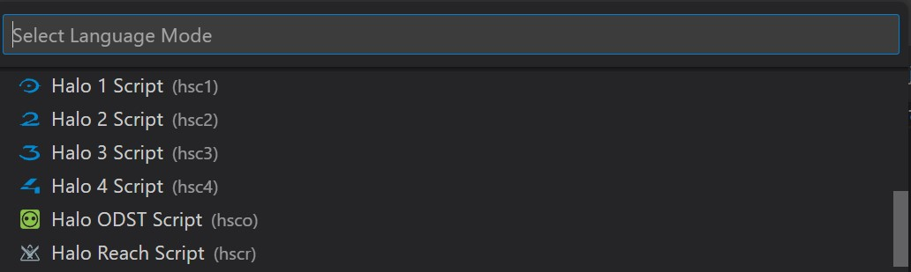
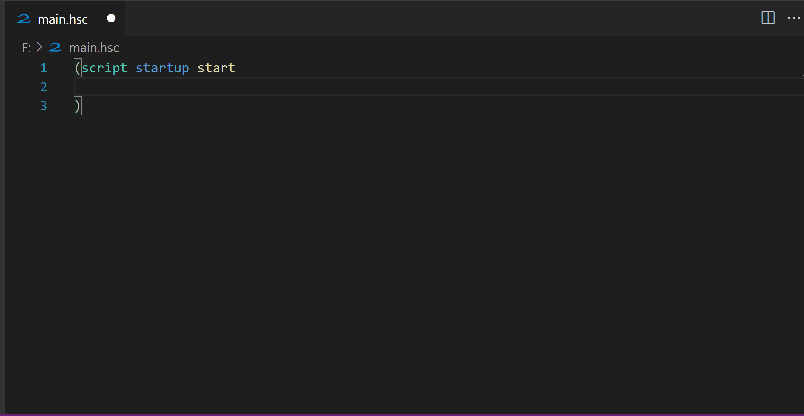

**HaloScript** is a comprehensive language support extension for all iterations of the Halo Script language used in the Halo: The Masterchief Collection Mod Tools. HaloScript provides:
- Autocompletion
- Documentation on all HaloScript functions
- Hover descriptions for HaloScript elements
- Function argument hints
- Syntax highlighting
- Snippets
- Error Checking

## Supported Games

| Game | Language |
| ----------- | ----------- |
| Halo 1 MCC | hsc1 |
| Halo 2 MCC | hsc2 | 
| Halo 3 MCC | hsc3 | 
| Halo ODST MCC | hsco | 
| Halo Reach MCC | hscr | 
| Halo 4 MCC | hsc4 | 

## Getting Started

### Setting the language

This extension contributes each game's Halo Script iteration as a separate language. Once you've opened a hsc file, you can select the correct HaloScript language for your current file from the ***Status Bar***.




The HaloScript syntax comes in two flavours, the classic lisp styled syntax used in Halo 1 - Halo Reach, and the newer C-like syntax featured in Halo 4.

 You can set the default .hsc file language by editing your user settings.json file. For example to set Halo 4 Script as the default you would add:

```
    "files.associations": {
        "*.hsc": "hsc4"
    },
```

HaloScript is compatiable with any VSCode theme. ***Dark (Visual Studio - C/C++)*** is the theme used in the examples below.

### Using Snippets

Snippets are templates you can add to help you quickly add code to your scripts. HaloScript includes a large number of snippets for quickly creating template scripts, variables and loops. Snippets are also the method for quickly accessing the various enum values present in HaloScript.

> If snippets are not showing when you start typing, you can press `CTRL+SPACE` to trigger Intellisense. Snippets can be distinguished from other autocomplete suggestions by the square icon. Once the snippet is highlighted, you can press `TAB` to insert it. Certain snippets included multiple parts, you can use `TAB` to jump between these.

The full snippets list can be accessed through the ***Command Palette*** (shortcut `CTRL+SHIFT+P`), and selecting ***Insert Snippet***.


### Autocompletion

HaloScript offers automcompletion for functions, built-in globals, value types, script types, and keywords. Autocomplete suggestions will show as you type. Use `TAB` to accept the autocomplete suggestion. 

Autocomplete suggestions will also display relevant information, such as descriptions and accepted arguments for a function. When accepting an autocomplete suggestion for a function, parentheses will be automatically inserted if they are not already present.


### Argument Hints

Argument hints are displayed when writing out a HaloScript function. These hints will highlight the structure of the arguments required for a function, the function description, the current argument to input, and a description of the type of argument to supply.

Arguments that end with `?` are optional.



### Hover Descriptions

Simply hover over any HaloScript function, built-in global, value type, or keyword to prompt a description of that item.


### Extension Recommendations

[TabOut](https://marketplace.visualstudio.com/items?itemName=albert.TabOut) lets you use the tab key to jump out parentheses using `TAB`. This will make it a much smoother experience to work with HaloScript given its heavy use of parentheses.

### Error Checking

HaloScript includes a basic level of debugging. The extension will report unmatched opening and closing parentheses, with plans to expand error checking further in the future.

## Credits

[Crisp](https://github.com/ILoveAGoodCrisp) - Extension Developer
[Alexis Jonsson](https://github.com/AlexisJonsson) - Icon design
[tdanese](https://github.com/tdanese) - Fixing an issue with matching parentheses error handling

### 2.3.0